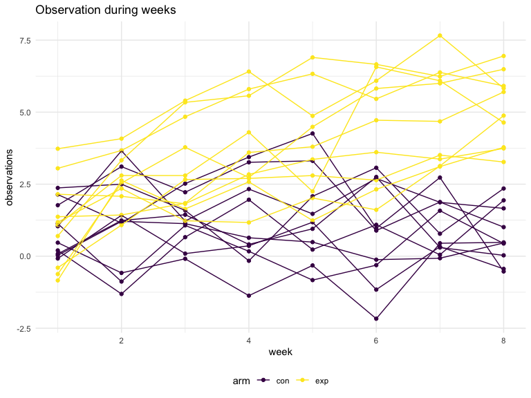

p8105\_hw5\_zh2494
================
zhuolun
11/16/2021

# question 1

``` r
homicide_df = 
  read_csv("./data/homicide-data.csv", na = c("", "Unknown")) %>% 
  mutate(city_state = str_c(city, state),
         resolution = case_when(
           disposition == "Closed without arrest" ~ "unsolved",
           disposition == "Open/No arrest"        ~ "unsolved",
           disposition == "Closed by arrest"      ~ "solved")) %>% 
  relocate(city_state) %>% 
  filter(city_state != "TulsaAL")
```

Let’s focus on Baltimore, MD.

``` r
baltimore_df = 
  homicide_df %>% 
  filter(city_state == "BaltimoreMD")

baltimore_summary = 
  baltimore_df %>% 
  summarize(
    unsolved = sum(resolution == "unsolved") ,
    n = n()
  )
baltimore_test =
  prop.test(
  x = baltimore_summary %>% pull(unsolved), 
  n = baltimore_summary %>% pull(n))

baltimore_test %>% 
  broom::tidy()
```

    ## # A tibble: 1 × 8
    ##   estimate statistic  p.value parameter conf.low conf.high method    alternative
    ##      <dbl>     <dbl>    <dbl>     <int>    <dbl>     <dbl> <chr>     <chr>      
    ## 1    0.646      239. 6.46e-54         1    0.628     0.663 1-sample… two.sided

there is 0.6455 that unsolved homicide in Baltimore unsolved The CI is
from 0.628 to 0.663

iterate across cities, test it on each cites.

``` r
prop_test_function = function(city_df){
  city_summary = 
    city_df %>% 
    summarize(
      unsolved = sum(resolution == "unsolved") ,
      n = n()
    )
  
  city_test =
    prop.test(
    x = city_summary %>% pull(unsolved), 
    n = city_summary %>% pull(n))

  return(city_test)
}
```

iterate across all cites

``` r
results_df = 
  nested_df = 
  homicide_df %>%
  nest(data = uid:resolution) %>% 
  mutate(
    test_results = map(data, prop_test_function),
    tidy_results = map(test_results, broom::tidy)
  ) %>% 
  select(city_state, tidy_results) %>% 
  unnest(tidy_results) %>% 
  select(city_state, estimate, starts_with("conf"))
```

try to make a plot showing estimates and confidence intervals

``` r
results_df %>% 
  mutate(city_state = fct_reorder(city_state, estimate)) %>% 
  ggplot(aes(x = city_state, y = estimate)) + 
  geom_point() +
  geom_errorbar(aes(ymin = conf.low, ymax = conf.high)) +
  theme(axis.text.x = element_text(angle = 90, vjust = 0.5, hjust = 1))
```


``` r
homicide_df %>% 
  group_by(city_state) %>% 
  summarize(
    unsolved = sum(resolution == "unsolved"),
    n = n()
  ) %>% 
  mutate(
    test_results = map2(unsolved, n, prop.test),
    tidy_results = map(test_results, broom::tidy)
  ) %>% 
  select(city_state, tidy_results) %>% 
  unnest(tidy_results) %>% 
  select(city_state, estimate, starts_with("conf"))
```

    ## # A tibble: 50 × 4
    ##    city_state    estimate conf.low conf.high
    ##    <chr>            <dbl>    <dbl>     <dbl>
    ##  1 AlbuquerqueNM    0.386    0.337     0.438
    ##  2 AtlantaGA        0.383    0.353     0.415
    ##  3 BaltimoreMD      0.646    0.628     0.663
    ##  4 Baton RougeLA    0.462    0.414     0.511
    ##  5 BirminghamAL     0.434    0.399     0.469
    ##  6 BostonMA         0.505    0.465     0.545
    ##  7 BuffaloNY        0.612    0.569     0.654
    ##  8 CharlotteNC      0.300    0.266     0.336
    ##  9 ChicagoIL        0.736    0.724     0.747
    ## 10 CincinnatiOH     0.445    0.408     0.483
    ## # … with 40 more rows

## problem2

read, clean and tidy data.  
`arm` shows which group this row belongs to. “con” means control group.
“exp” means experimental group.  
`id` contains identiacl id for each participants.  
`week` means the number of week of observation.  
`observation` is the measured value of interest.

``` r
data_df = 
  tibble(
  file_name = list.files("./data/zip_data/")) %>% 
  mutate(
    path = str_c("./data/zip_data/", file_name),
    data = map(.x = path, ~read_csv(.x)),
    arm = str_extract(file_name, "[a-z]{1,3}"),
    id = readr::parse_number(file_name)) %>% 
  select(arm, id, data) %>% 
  unnest(data) %>% 
  pivot_longer(
    week_1:week_8,
    names_to = "week",
    values_to = "observations"
  ) %>% 
  mutate(
    week = readr::parse_number(week)
  )
```

``` r
head(data_df)
```

    ## # A tibble: 6 × 4
    ##   arm      id  week observations
    ##   <chr> <dbl> <dbl>        <dbl>
    ## 1 con       1     1         0.2 
    ## 2 con       1     2        -1.31
    ## 3 con       1     3         0.66
    ## 4 con       1     4         1.96
    ## 5 con       1     5         0.23
    ## 6 con       1     6         1.09

Make a spaghetti plot showing observations on each subject over time,
and comment on differences between groups.

``` r
data_df %>% 
  unite(arm_id, c(arm, id), sep = " ", remove = FALSE) %>% 
  select(-id) %>% 
  ggplot(aes(x = week, y = observations)) + 
  geom_point(aes(group = arm_id, color = arm)) +
  geom_line(aes(group = arm_id, color = arm)) +
  ggtitle("Observation during weeks")
```



Comment: From the graph we can see that the observations in control
group is higher than that in experiment group.

## problem 3

``` r
set.seed(10)

iris_with_missing = 
  iris %>%
  map_df(~replace(.x, sample(1:150, 20), NA)) %>%
  mutate(Species = as.character(Species)) %>% 
  janitor::clean_names()
```

write a function that takes a vector as an argument; replaces missing
values using the rules defined:  
For numeric variables, you should fill in missing values with the mean
of non-missing values  
For character variables, you should fill in missing values with
“virginica”.

``` r
fill_in_missing = function(x) {
  if (is.numeric(x)) {
    x = replace(x, is.na(x), mean(x, na.rm = TRUE))
  }
  if (is.character(x)) {
    x = replace(x, is.na(x), "virginica")
  }
  return(x)
}
```

For every vector in data frame (iris\_with\_missing) value run into this
function. The result is the iris\_without\_missing

``` r
iris_without_missing =
  map_dfr(iris_with_missing, fill_in_missing)

iris_without_missing
```

    ## # A tibble: 150 × 5
    ##    sepal_length sepal_width petal_length petal_width species
    ##           <dbl>       <dbl>        <dbl>       <dbl> <chr>  
    ##  1         5.1          3.5         1.4         0.2  setosa 
    ##  2         4.9          3           1.4         0.2  setosa 
    ##  3         4.7          3.2         1.3         0.2  setosa 
    ##  4         4.6          3.1         1.5         1.19 setosa 
    ##  5         5            3.6         1.4         0.2  setosa 
    ##  6         5.4          3.9         1.7         0.4  setosa 
    ##  7         5.82         3.4         1.4         0.3  setosa 
    ##  8         5            3.4         1.5         0.2  setosa 
    ##  9         4.4          2.9         1.4         0.2  setosa 
    ## 10         4.9          3.1         3.77        0.1  setosa 
    ## # … with 140 more rows
